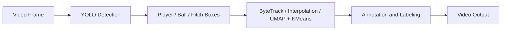

# ML - Futbol Architecture Overview

This document explains how the components of ML-Futbol are organized and how they interact in the video analysis pipeline.

## System Overview

The system uses a modular, class-based structure. Each component (ball, pitch, player detection) is encapsulated in its own class and receives a shared configuration and model loader.

## Core Components

### `Config`
- Sets input/output paths
- Selects the type of analysis to run (`Player_Detection`, `Pitch_Detection`, etc.)
- Found in: `ai_futobl_main_classes.py`

### `Models`
- Loads all pretrained YOLO models
- Prevents redundant loading across detection modules
- Found in: `ai_futobl_main_classes.py`

## Detection Modules

### `PlayerDetection`
- Uses YOLO to detect players, referees, and goalkeepers
- Tracks movement using ByteTrack
- Assigns team IDs using TeamClassifier
- Annotates each player with labels and shapes

### `BallDetection`
- Detects the ball
- Annotates it with triangle overlays
- Interpolates missing ball positions when not detected

### `PitchDetection`
- Detects field keypoints (penalty box, center circle, etc.)
- Computes a homography matrix
- Overlays a 2D pitch model onto each video frame

## Supporting Modules

### `TeamClassifier`
- Extracts embeddings using SigLIP
- Reduces dimensions with UMAP
- Clusters players using KMeans to assign team identity (0 or 1)
- Found in: team_classifier.py

### `ViewTransformer`
- Computes and applies homography for pitch overlays
- Found in: view_transformer.py

### `Kalman`
- Smooths player/ball trajectories with a Kalman filter
- Found in: kalman.py and kalman_filter.py

### `Pitch Geometry`
- Encodes reference points and pitch layout (vertices + edges)
- Found in: pitch_config.py
- Used for overlaying the 2D pitch model

### `Pitch Rendering`
- Draws pitch lines, Voronoi maps, and points
- Found in: pitch_draw.py

## How It All Connects

## Outputs

- Annotated video(s):
  - `anottated_player_video.mp4` – Player tracking and team labeling
  - `anotatted_pitch_video.mp4` – Pitch keypoints and field overlay
  - `ball_video_detection.mp4` – Ball location with triangle overlay
  - `kalman.mp4` – Smoothed trajectories using Kalman filter
  - `track_ball_video.mp4` – Ball tracking including interpolated frames

- CSV tracking data:
  - `player_coordinates.csv` – X, Y, team ID per frame per player
  - `ball_visibility.csv` – Whether the ball was visible each frame
  - `player_visibility.csv` – Whether each player was visible in each frame

